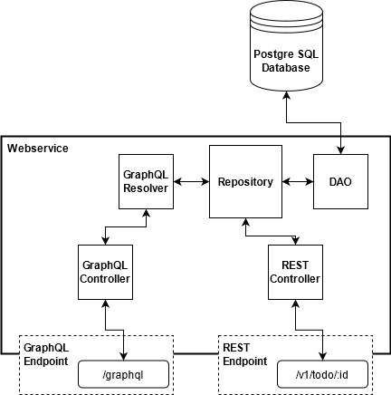

# TodoApp - Rest & GraphQL Sample

Inspired by

- [bootstrap-play2](https://github.com/innFactory/bootstrap-play2)

## Architecture



## Starting the webservice

```bash
# Start your postgres instance
cd ./local-runner
docker compose up -d
cd ..
# migrate database
sbt flyway/flywayMigrate
# generate code
sbt slickGen
# start the webservice
sbt run
```

## Testing

### Postman

- open your postman installation
- import the postman collection from [.\doc\GraphQL-TodoApp-Testchain.postman_collection.json](.\doc\GraphQL-TodoApp-Testchain.postman_collection.json)
- make sure you have started the webservice
- run the collection  
  

### ScalaTest + Play

```bash
# Make sure the database is down if you have run the server before
# Windows
"./.test/runtest.bat"
# Unix/Mac
./.test/runtest.sh
```

## Schema Validation

- validation with [GraphQL Inspector](https://github.com/kamilkisiela/graphql-inspector)
- generate schema with:
  ```bash
  sbt graphqlSchemaGen
  ```
  output is saved in [schema.graphql](./schema.graphql)
- github action configuration is found in [.github/schema-validation.yml](./.github/schema-validation.yml)
- schema is validated on pull request to master
- validation will fail on breaking changes
- use label 'expected-breaking-change' to mark a pull request when breaking changes are expected, e.g. [https://github.com/anderha/todo-rest-graphql-sample/pull/3](https://github.com/anderha/todo-rest-graphql-sample/pull/3)
